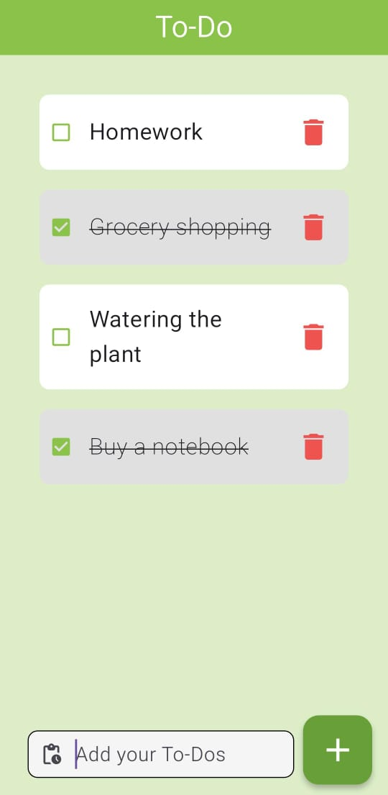

# ✅ Flutter To-Do App

A simple and elegant To-Do app built with **Flutter**, using **Sqflite** for persistent local storage.  
You can **add**, **delete**, and **mark tasks as completed** with a clean, intuitive interface.

---

## ✨ Features

- ➕ Add new to-do items
- ✅ Mark tasks as completed (adds strikethrough to the text)
- 🗑️ Delete tasks
- 💾 Persistent local storage using **Sqflite**

---

## 🖼️ Screenshot

---
